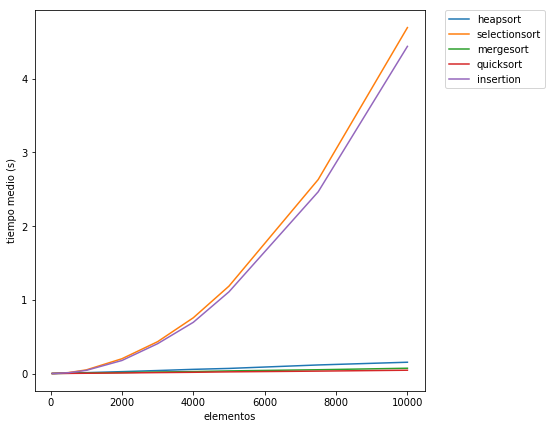
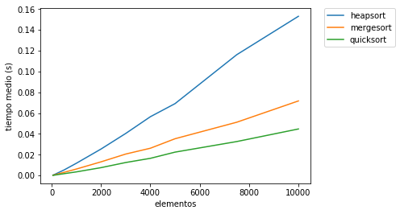
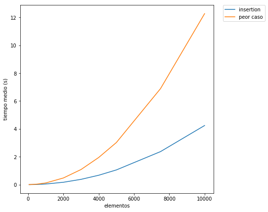
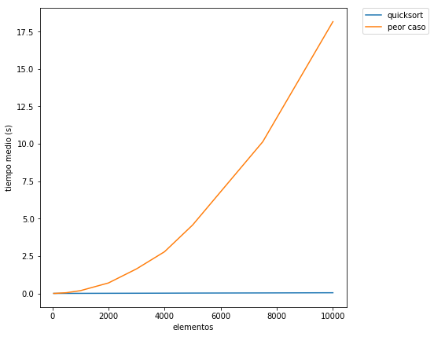

\newpage

# Parte 1: Cálculo empírico de tiempos de ejecución

## Consigna

Implementar los siguientes algoritmos de ordenamiento para números enteros positivos:

* Selección
* Inserción
* Quicksort
* Heapsort
* Mergesort

a) Para cada uno de ellos analizar su complejidad teórica y compararlos (tiempo promedio y peor tiempo). Tener en cuenta las constantes para la comparación.

b) Construir 10 sets de números aleatorios con 10.000 números positivos.

c) Calcular los tiempos de ejecución de cada algoritmo utilizando los primeros: 50, 100, 500, 1000, 2000, 3000, 4000, 5000, 7500, 10000 números de cada set.

d) Estimar los tiempos medios de ejecución para cada rango-algoritmo y graficar.

e) Determinar para cada algoritmo anterior las características que debe tener un set para que se comporte de la peor forma posible (si el algoritmo lo permite).

f) Construir para cada algoritmo y para los rangos del punto “C” sets con las peores características y evaluar los tiempos de ejecución. Comparar con los generados con los sets aleatorios y graficar.

g) En base a los tiempos obtenidos compare con los valores teóricos y analice (Extensión máxima de 2 párrafos).

## Solución

### A)

| Algoritmo | Complejidad teórica( Promedio ) | Mejor caso  | Peor caso |
| ----------|---------------------------------| ------------| -------- |
| Selección | *$O(n^2)$*        | *$O(n^2)$* | *$O(n^2)$* |
| Inserción | *$O(n^2)$*       |*$O(n)$*| *$O(n^2)$*|
| Quicksort | *$O(n \log n)$*   | *$O(n)$* | *$O(n^2)$* |
| Heapsort  | *$O(n \log n)$*  |*$O(n)$*|*$O(n \log n)$*|
| Mergesort | *$O(n \log n)$*  |*$O(n)$*|*$O(n \log n)$*|

#### Demostraciones

##### Seleccion

Dado nuestro código utilizado

```
def selection_sort(list_test) :
    for x in range(len(list_test) - 1, 1, -1):
        pos_of_max = 0
        for y in range(x, len(list_test)):
            if list_test[y] > list_test[pos_of_max]:
                pos_of_max = y
        swap(list_test, x, pos_of_max)
    return list_test

```

| Algoritmo | Complejidad | Ejecuciones
| ----------|---------------------------------|---
|     for x in range(len(list_test) - 1, 1, -1):| C1 | n
|        pos_of_max = 0 |C2 | n-1|
|        for y in range(x, len(list_test)): |C3|
|            if list_test[y] > list_test[pos_of_max]: |[*]C3| n(n+1)/2|
|                pos_of_max = y|C3 |
|        swap(list_test, x, pos_of_max)|C4|(n-1) * 3 (porque son 3 lineas)|
|    return list_test||

[*] Se llega al C3 porque se ejecuta de la siguiente manera:
  Primer loop : $2 \xrightarrow{hasta} n$
  Segundo loop : $3 \xrightarrow{} n - 1$
  Tercer loop : $4 \xrightarrow{} n -2$
  Ultimo loop : $n-1 \xrightarrow{} 1$
  Sumando todo da
  $$ n + (n-1) + .... + 1 = n (\frac{n + 1}{2})$$

*Tiempo Total*

$$\begin{aligned}
T(n) &= C1 \times n + C2 \times (n-1) + C3 \times (\frac{n(n+1)}{2}) + C4 \times (n-1) \times 3 \\
&= C3 \times \frac{n^2}{2} + (C1 + C2 + \frac{C3}{2} + C4 \times 3) \times n + (-C2 - C4 \times 3) \\
 &= a^2 + b * n + c = O(n^2)
\end{aligned}$$

##### Inserción

Dado nuestro código utilizado

```
def insertion_sort(list_test) :
    for y in range(1, len(list_test)) :
        key = list_test[y]
        x = y - 1
        while x > 0 and list_test[x] > key :
            list_test[x + 1] = list_test[x]
            x = x - 1
        list_test[x + 1] = key
    return list_test
```

| Algoritmo | Complejidad | Ejecuciones
| ----------|---------------------------------|---
|def insertion_sort(list_test) :|  | |
|    for y in range(1, len(list_test)) :|C1| $n$
|        key = list_test[y]|C2| $n - 1$
|        x = y - 1|C3| $n - 1$
|        while x > 0 and list_test[ x ] > key :|C4| [*] $\sum_{x=1}^{n} t_j$
|            list_test[x + 1] = list_test[x]|C5| $\sum_{x=1}^{n} (t_j - 1)$
|            x = x - 1|C6| $\sum_{x=1}^{n} (t_j - 1)$
|        list_test[x + 1] = key|C7| $ n - 1 $
|    return list_test||

[*] Número de veces que se ejecuta el while para un valor de j

$$
\begin{aligned}
T(n) &= C1  n + C2  (n - 1) + C3  (n - 1) + C4 \sum_{j=1}^{n} (t_j) + C5 \sum_{j=1}^{n} (t_j - 1) + C6 \sum_{j=1}^{n} (t_j - 1) + C7 (n - 1) \\
\sum_{j=1}^{n} (t_j - 1) &= 1 + 2 + ... + n - 1 + n = \frac{n(n-1)}{2} \\
\sum_{x=1}^{n} (t_j) &= \frac{n(n-1)}{2} - 1
\end{aligned} $$

Sabiendo

Entonces :
$$
\begin{aligned}
&= C1 n + C2 (n - 1) + C3 (n - 1) + C4(\frac{n(n-1)}{2} - 1) + C5 \frac{n(n-1)}{2} + C6 \frac{n(n-1)}{2} + C7 (n - 1) \\
&=  ( \frac{C4}{2} + \frac{C5}{2} + \frac{C6}{2}) n^2 + (C1 + C2 + C3 - \frac{C4}{2} - \frac{C5}{2} - \frac{C6}{2} + C7)  n - (C2 + C3 + C4 + C5 + C6 + C7) \\
&= a n^2 + bn + c = O(n^2)
\end{aligned}
$$

##### Quicksort

Implementacion recursiva:
Nota: en el trabajo se utilizó una implementación iterativa pero para
explicar este punto se utiliza la implementación recursiva

```
def quick_sort_method(list_test, start, end) :
  if ( start < end ):
    newIndex = partition(list_test, start, end)
    quick_sort_method(list_test, start, newIndex - 1)
    quick_sort_method(list_test, newIndex + 1, end)

def partition(list_test, start, end) :
  pivot = list_test[end]
  x = start - 1
  for y in range(start, end):
    if list_test[y] <= pivot:
      x = x + 1
      swap(list_test, x, y)
  swap(list_test, x + 1, end)
  return x + 1

```


| Algoritmo | Complejidad | Tiempo de ejecucion
|-----------|-------------|--------------------
def quick_sort_method(list_test, start, end) :||
  if ( start < end ):||
    newIndex = partition(list_test, start, end)||n
    quick_sort_method(list_test, start, newIndex - 1)|| i ( tiempo en ejecutar primer subarray)
    quick_sort_method(list_test, newIndex + 1, end)||n - 1 - i ( tiempo en ejecutar último subarray)

Esto se traduce como
$$ T(n) = cn + T(i) + T(n -1 -i) $$

Para el caso promedio de todas las posibles particiones se escribe como:
$$ \begin{aligned}
T(n) &= \frac{1}{n} \sum_{i=0}^{n-1} (T(i) + T(n - i - 1 ) + cn) \\
&= \frac{2}{n}[T(0) + T(1) + \dots + T(n-2) + T(n-1)] + cn
\end{aligned} $$
o bien,
$$ \begin{aligned}
n T(n) &= 2(T(0) + T(1) + \dots + T(n-2) + T(n-1)) + n^2 \\
(n-1) T(n-1) &= 2 (T(0) + T(1) + ... + T(n-2)) + c(n-1)^2
\end{aligned} $$
-
$$ \begin{aligned}
n(T(n)) - (n-1) T(n-1) &= 2T(n-1) + 2cn - c \approx 2T(n-1) + 2cn \\
nT(n) - (n-1)T(n-1) &= 2T(n-1) + 2cn
\end{aligned} $$
o bien,
$$
\begin{aligned}
\frac{T(n)}{n+1} &= \frac{T(n-1)}{n} + \frac{2c}{n+1}
\end{aligned}
$$

Aplicando un telescopeo a  $\frac{T(n)}{n+1}$: $$\frac{2c}{n+1} = \frac{T(n-1)}{n}$$
y se obtiene la forma explícita:

$$
\frac{T(n)}{n+1} + \frac{T(n-1)}{n} + \frac{T(n-2)}{n-1} + \dots + \frac{T(2)}{3} + \frac{T(1)}{2} - \frac{T(n-1)}{n} - \frac{T(n-2)}{n-1} - \dots - \frac{T(2)}{3} - \frac{T(1)}{2} - \frac{T(0)}{1} = $$
$$\frac{2c}{n+1}  + \frac{2c}{n} + \dots + \frac{2c}{3} + \frac{2c}{2} $$

Finalmente
$$\frac{T(n)}{n+1} = \frac{T(n)}{2} + 2c\sum_{j=3}^{n+1} (\frac{1}{j})$$

Como $n$ se hace muy grande,
$\sum_{i=3}^{n+1} (\frac{1}{j})$ se aproxima a $ln(n) + \gamma$ donde $\gamma$ es la constante de Euler $\approx 0,577\dots$

Por lo tanto
$$\frac{T(n)}{n+1} = \frac{T(1)}{2} + 2c \ln(n) + 2c\gamma = \ln(n) + c2 = O(\ln(n))$$

Finalmente entonces
$$T(n) = O(n \log(n))$$

##### Heapsort

```
def heap_sort(list_test) :
  heap_size = len(list_test) - 1
  build_heap(list_test, heap_size)
  for x in range(len(list_test) - 1, 0, -1) :
    swap(list_test, 0, x)
    heap_size = heap_size - 1
    max_heapify(list_test, heap_size, 0)
```

| Algoritmo |  Tiempo de ejecución   
|-----------|--------------------
|def heap_sort(list_test) :| |
|  heap_size = len(list_test) - 1|$1$ |
|  build_heap(list_test, heap_size)| $n$ [por definicion] |
|  for x in range(len(list_test) - 1, 0, -1) |n |
|  swap(list_test, 0, x) | $3n$ |
|    heap_size = heap_size - 1|$n$ |
|    max_heapify(list_test, heap_size, 0)| $O(n \log n)$ [por definicion] |


En promedio se realiza en $n$ iteraciones un max_heapify que lleva $O(\log n)$, por lo tanto el costo temporal de este algoritmo en promedio es de O$(n \log n)$

##### Megesort

```
def merge_sort_method(list_test, start, end) :
    if start < end :
        middle = int(( start + end) / 2)
        merge_sort_method(list_test, start, middle)
        merge_sort_method(list_test, middle + 1, end)
        merge(list_test, start, middle , end)
```

| Algoritmo |   Tiempo de ejecución
|-----------|-------------------------
def merge_sort_method(list_test, start, end) :||
|    if start < end :| $n$|
|        middle = int(( start + end) / 2)| $n$|
|        merge_sort_method(list_test, start, middle)|$n/2$|
|        merge_sort_method(list_test, middle + 1, end)|$n/2$|
|        merge(list_test, start, middle , end)|$n$|

El número de comparaciones de una lista con tamaño $n$ satisface la forma recurrente:
$$ T(n) = T(\frac{n}{2}) + T(\frac{n}{2}) + a(n) $$ $$1 \le a(n) \le n-1$$

Resolviendo la ecuacion de recurrencia usando $n=2^m$ en la ecuación $$T(n={2^m}) = 2T(2^{m-1}) + \alpha 2^{m}$$
se tiene

$$
\begin{aligned}
T(2^m) &= 2T(2^{m-1}) +  \alpha 2^{m}  \xrightarrow {\times 2^0} T(2^{m}) - 2T(2^{m-1}) &= \alpha2^{m} \\
T(2^{m-1}) &= 2T(2^{m-2}) +  \alpha 2^{m-1} \xrightarrow{ \times 2^1} 2T(2^{m-1}) - 2^2T(2^{m-2}) &= \alpha 2^{m} \\
T(2^{m-2}) &= 2T(2^{m-3}) +  \alpha 2^{m-1} \xrightarrow{ \times 2^2} 2^2T(2^{m-2}) - 2^3T(2^{m-3}) &= \alpha 2^{m} \\
T(2^2) &= 2T(2^1) + \alpha 2^2 \xrightarrow{\times 2^{m-2}} 2^{m-2}T(2^2)- 2^{m-1}T(2^1) &= \alpha 2^m \\
T(2^1) &= 2T(2^0) + \alpha 2^1 \xrightarrow{\times 2^{m-1}} 2^{m-1}T(2^1)- 2^{m}T(2^0) &= \alpha 2^m \\
\end{aligned}
$$.

$$\boxed{T(1) = 0} $$
$$\boxed{T(2^{m}) = \alpha2^{m} m}$$

Entonces, $\boxed{T(n) \approx \alpha  n  \log(n)}$


### D)


#### Tiempo medio con 50 iteraciones:

| Algoritmo | Tiempo medio (seg) |
|-----------|--------------------|
| Heapsort  | 0.0003298004807970045 |
| Selección | 0.00013083834977933861 |
| Mergesort | 0.00023580199998107787 |
| Quicksort | 0.00012194083406313894 |
| Inserción | 0.00010067983583716966 |

#### Tiempo medio con 100 iteraciones:

| Algoritmo | Tiempo medio (seg) |
|-----------|--------------------|
| Heapsort  | 0.0007247297246397721 |
| Selección | 0.0004486266798213734 |
| Mergesort | 0.00047982986346184475 |
| Quicksort | 0.0002497603338049714 |
| Inserción | 0.0003789045405540037 |

#### Tiempo medio con 500 iteraciones:

| Algoritmo | Tiempo medio (seg) |
|-----------|--------------------|
| Heapsort  | 0.004888808857476334 |
| Selección | 0.011094667812789893 |
| Mergesort | 0.002757735193334554 |
| Quicksort | 0.001501715076367205 |
| Inserción | 0.01042211682185723 |

#### Tiempo medio con 1000 iteraciones:

| Algoritmo | Tiempo medio (seg) |
|-----------|--------------------|
| Heapsort  | 0.01082875558189933 |
| Selección | 0.04502248397095876 |
| Mergesort | 0.00584529233796971 |
| Quicksort | 0.003506901652045258 |
| Inserción | 0.0409498724160553 |

#### Tiempo medio con 2000 iteraciones:

| Algoritmo | Tiempo medio (seg) |
|-----------|--------------------|
| Heapsort  | 0.02383555138088056 |
| Selección | 0.17983277715210022 |
| Mergesort | 0.012822466433798141 |
| Quicksort | 0.007783576734286868 |
| Inserción | 0.16681784541239786 |

#### Tiempo medio con 3000 iteraciones:

| Algoritmo | Tiempo medio (seg) |
|-----------|--------------------|
| Heapsort  | 0.037735805689562696 |
| Selección | 0.4071431871011413 |
| Mergesort | 0.01896053938660458 |
| Quicksort | 0.011680128970684933 |
| Inserción | 0.3761444555486815 |

#### Tiempo medio con 4000 iteraciones:

| Algoritmo | Tiempo medio (seg) |
|-----------|--------------------|
| Heapsort  | 0.05221940992985097 |
| Selección | 0.7219840037342387 |
| Mergesort | 0.026011349667937722 |
| Quicksort | 0.016142009466967977 |
| Inserción | 0.6706326836875611 |

#### Tiempo medio con 5000 iteraciones:

| Algoritmo | Tiempo medio (seg) |
|-----------|--------------------|
| Heapsort  | 0.06716955575572925 |
| Selección | 1.1285243604194548 |
| Mergesort | 0.032795204257913824 |
| Quicksort | 0.0222334473710184 |
| Inserción | 1.0522567008789494 |

#### Tiempo medio con 7500 iteraciones:

| Algoritmo | Tiempo medio (seg) |
|-----------|--------------------|
| Heapsort  | 0.10555483218916883 |
| Selección | 2.533056245873178 |
| Mergesort | 0.05055741457614715 |
| Quicksort | 0.03188779323241775 |
| Inserción | 2.3673165623728547 |

#### Tiempo medio con 10000 iteraciones:

| Algoritmo | Tiempo medio (seg) |
|-----------|--------------------|
| Heapsort  | 0.1456751018200908 |
| Selección | 4.51789061094763 |
| Mergesort | 0.06924800057395863 |
| Quicksort | 0.04411823011679061 |
| Inserción | 4.242444782562448 |

#### Gráfico para comparar todos los algoritmos con los tiempos medios



#### Gráfico para comparar todos los algoritmos con los tiempos medios (excepto heapsort e Inserción )


### E y F)

**Selección:**
En este algoritmo de ordenamiento no hay un set de datos que haga que se comporte de la peor manera posible ya que indistintamente de los datos el algoritmo hará la misma cantidad de comparaciones.

**Inserción**
El peor rendimiento de este algoritmo se dará en casos en los que los datos estén ordenados de manera inversa a lo que se quiere obtener. Por ejemplo si se quiere ordenar de menor a mayor los enteros del uno al diez. Para obtener el peor caso los datos deberían estar ordenados de esta mayor a menor [10, 9, 8, 7, 6, 5, 4, 3, 2, 1].

##### Comparación caso promedio con peor caso



**Quicksort**
El algoritmo puede alcanzar el orden *$O(n^2)$* en algunos casos, siendo este el peor escenario posible. El caso se da cuando los pivotes elegidos son los menores o mayores elementos del arreglo en todas las iteraciones recursivas del arreglo. Por ejemplo si se quiere ordenar el arreglo ordenado *$[1,2,3,4,5]$* de menor a mayor y si toma el último elemento del arreglo como pivote en cada iteración. Lo que resulta en que se haga la mayor cantidad de comparaciones, alcanzando el orden cuadrático.

##### Comparación caso promedio con peor caso



**Heapsort**
En el heapsort no importa el orden en el que se encuentren los datos ya que se realizan la misma cantidad de comparaciones (aproximadas) en todos los arreglos indistintos del orden o desorden de los datos. En cualquier caso el heapsort mantiene el orden *$O(n \log n)$*.

### G)
* En los casos de SelectionSort e InsertionSort se puede ver que no hay demasiada diferencia con los tiempos medios de estos algoritmos con un sets de datos al azar, puesto que deben recorrer ciclos completos y hacer comparaciones, lo que no cambia mucho utilizarsets de datos considerados desfavorables.
* En el Quicksort la diferencia es abismal, al tener todo el array ya ordenado obliga a hacer todas las comparaciones y la diferencia se pronuncia aún más cuanto más grande es el tamaño del array
* Tanto en el HeapSort como en el MergeSort, la cantidad de comparaciones que se deben realizar son de O(n log n) por lo que casi no hay diferencia al compararse con arrays que puedan llevar a un peor caso.


